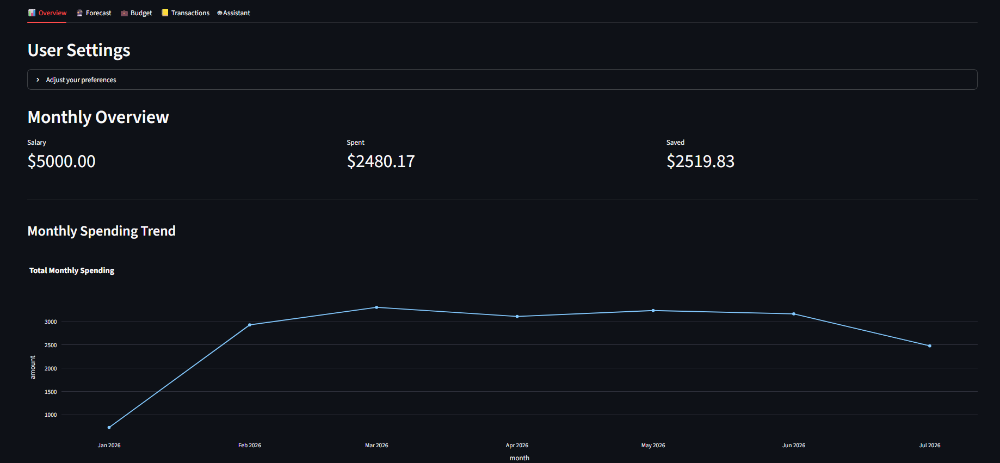
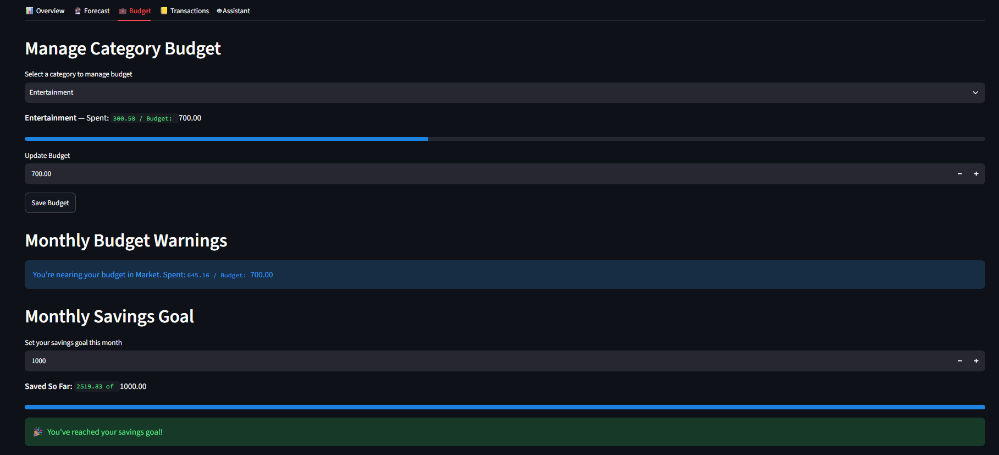
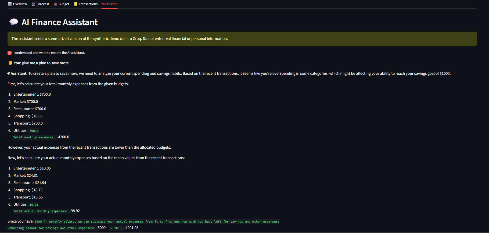

# Finance Intelligence Assistant


An interactive personal-finance analytics application combining leakage-safe time-series forecasting, personalized XGBoost models, budget monitoring, transaction analytics, and an optional LLM-powered financial assistant.

> **Portfolio project:** All demonstration data is synthetic. This application does not provide professional financial advice.

## Application Preview

### Financial Overview

Monitor monthly income, total spending, savings, category distribution, spending trends, and spending pace.



### Spending Forecast

Generate category-level spending forecasts and compare projected spending against configured budgets.


### Budget Tracking

Manage category budgets, identify overspending risks, and track progress toward monthly savings goals.



### AI Finance Assistant

Ask contextual questions about synthetic financial activity using the optional Groq-powered assistant.



## Core Capabilities

* Interactive Streamlit financial dashboard
* Daily, monthly, and category-level spending analytics
* Leakage-safe time-series feature engineering
* XGBoost spending forecasting
* Chronological train-validation splitting
* Naive-baseline model comparison
* Optional user-specific residual correction
* Category budget monitoring and warnings
* Monthly savings-goal tracking
* Transaction creation, editing, and deletion
* Optional Groq-powered financial assistant
* Automated testing with `pytest`
* Code-quality validation with Ruff
* Continuous integration through GitHub Actions

## Technical Architecture

```text
Synthetic financial data
        |
        v
Data validation and daily aggregation
        |
        v
Leakage-safe time-series features
        |
        v
Global XGBoost forecasting model
        |
        +--------------------------+
        |                          |
        v                          v
Base forecast          User residual model
        |                          |
        +------------+-------------+
                     |
                     v
          Personalized forecast
                     |
          +----------+----------+
          |                     |
          v                     v
Streamlit analytics     LLM-generated insights
```

## Forecasting Methodology

The forecasting pipeline creates:

* Calendar features
* Lag features
* Rolling averages
* Historical difference features
* Weekend indicators

All target-derived features are shifted before calculation. A prediction therefore uses only information that would have been available before the prediction date.

Model validation uses a chronological holdout rather than a random train-test split. This provides a more realistic evaluation for time-series forecasting.

Each XGBoost model is compared with a lag-based naive baseline.

Generated model metrics are stored in:

```text
reports/model_metrics.csv
```

The evaluation file includes:

* Category
* Training-row count
* Test-row count
* XGBoost MAE
* Baseline MAE

## Personalization Strategy

The application supports two forecasting layers:

1. **Global model**

   Learns general spending patterns from the synthetic training dataset.

2. **Personalized residual model**

   Learns the difference between the global model prediction and a specific user's historical spending.

The final personalized prediction is calculated as:

```text
Personalized forecast = Global forecast + Predicted user residual
```

When a trained model is unavailable, the application falls back to a recent-average baseline.

## Project Structure

```text
finance-assistant-project/
├── .github/
│   └── workflows/
│       └── ci.yml
├── app/
│   ├── __init__.py
│   ├── budget_tab.py
│   ├── chatbot_tab.py
│   ├── demo_data.py
│   ├── forecast_tab.py
│   ├── overview_tab.py
│   ├── transactions_tab.py
│   └── user_data_manager.py
├── core/
│   ├── __init__.py
│   ├── feature_engineering.py
│   ├── model_loader.py
│   └── train/
│       ├── __init__.py
│       ├── train_global.py
│       └── train_residual.py
├── data/
│   └── synthetic_finance_data.csv
├── images/
│   ├── overview.png
│   ├── forecast.png
│   ├── budget.png
│   └── chatbot.png
├── models/
├── reports/
│   └── model_metrics.csv
├── tests/
│   ├── test_feature_engineering.py
│   ├── test_model_loader.py
│   └── test_user_data_manager.py
├── utils/
│   ├── __init__.py
│   └── llm.py
├── streamlit_app.py
├── .env.example
├── .gitignore
├── pyproject.toml
├── requirements.txt
├── requirements-dev.txt
├── LICENSE
└── README.md
```

## Local Setup

### 1. Clone the repository

```bash
git clone https://github.com/fahimakhalifa/finance-assistant.git
cd finance-assistant-project
```

### 2. Create a virtual environment

```bash
python -m venv .venv
```

Activate it on Windows:

```bash
.venv\Scripts\activate
```

Activate it on macOS or Linux:

```bash
source .venv/bin/activate
```

### 3. Install application dependencies

```bash
python -m pip install --upgrade pip
pip install -r requirements.txt
```

Install development dependencies:

```bash
pip install -r requirements-dev.txt
```

### 4. Run the application

```bash
streamlit run streamlit_app.py
```

The application will normally open at:

```text
http://localhost:8501
```

## Optional AI Assistant

The dashboard and forecasting functionality work without an API key.

To enable the AI assistant, copy `.env.example` to `.env`.

On Windows:

```bash
copy .env.example .env
```

On macOS or Linux:

```bash
cp .env.example .env
```

Add your Groq configuration:

```env
GROQ_API_KEY=your_real_groq_api_key
GROQ_MODEL=llama-3.1-8b-instant
```

Never commit the `.env` file or expose the API key publicly.

## Training the Global Models

Run:

```bash
python -c "from core.train.train_global import train_global_models; print(train_global_models('data/synthetic_finance_data.csv'))"
```

The command will:

* Train one model per supported spending category
* Save trained models in `models/`
* Compare each model with a naive baseline
* Save evaluation results in `reports/model_metrics.csv`

## Testing and Code Quality

Run the automated tests:

```bash
pytest -q
```

Run static code-quality checks:

```bash
ruff check .
```

Apply Ruff formatting:

```bash
ruff format .
```

Run the complete local validation workflow:

```bash
ruff format .
ruff check .
pytest -q
```

The same checks run automatically through GitHub Actions on pushes and pull requests targeting the `main` branch.

## Privacy

The public portfolio demo uses synthetic financial data.

The AI assistant requires explicit user consent before sending an aggregated financial summary to the Groq API.

Do not enter:

* Real bank-account details
* Credit-card information
* Passwords
* Identification numbers
* Real salary or transaction information
* Other personally identifiable information

## Security Scope

This repository is designed as an applied machine-learning portfolio project.

It does not provide:

* Production-grade authentication
* Encrypted financial-data storage
* Regulatory compliance controls
* Secure multi-user database isolation
* Professional financial recommendations

## Limitations

* Forecast accuracy depends on the amount and quality of historical data.
* The demonstration dataset is synthetic and may not represent real-world financial behavior.
* Forecasts are point estimates and do not currently include uncertainty intervals.
* Local file persistence is used for demonstration purposes.
* LLM responses may be incomplete or inaccurate.
* The application should not be used as the sole basis for financial decisions.

## Future Improvements

* PostgreSQL-backed persistence
* Secure authentication and authorization
* Docker containerization
* MLflow experiment tracking
* Automated model monitoring
* Forecast uncertainty intervals
* SHAP-based model explanations
* Walk-forward model validation
* Multi-step forecasting evaluation
* Automated model retraining
* Cloud-hosted inference
* API-based backend architecture
